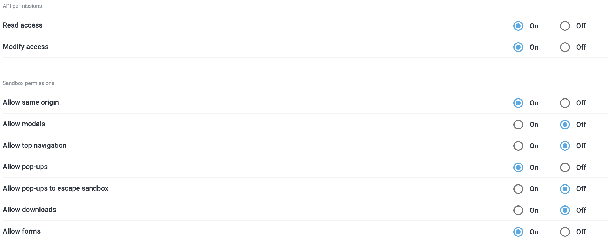
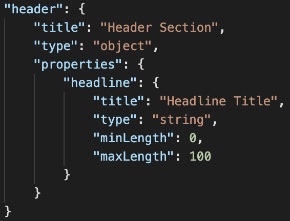

# dc-extension-globallink-dashboard

## Configuration

This section covers how to configure the GlobalLink Connect dashboard extension and tailor it to your organisation's specific requirements, and enable the sending of content from Dynamic Content for translation.

Alternatively, return to [README.md](../README.md) for more information on the extension.

<!-- MarkdownTOC autolink="true" -->

- [Prerequisites](#prerequisites)
- [How to install](#how-to-install)
  - [Register Extension](#register-extension)
  - [Permissions](#permissions)
- [How to configure](#how-to-configure)
  - [Example Configuration](#example-configuration)
  - [Definitions](#definitions)
    - [General](#general)
    - [Projects](#projects)
    - [Translatable fields](#translatable-fields)
    - [Templates](#templates)

<!-- /MarkdownTOC -->

## Prerequisites

To configure the GlobalLink Connect extension,

* A valid Amplience Dynamic Content user account (with Developer or Administrator permissions).
* A valid API Key & Connector ID for GlobalLink Connect Cloud API.

## How to install

### Register Extension

To use the GlobalLink Connect dashboard extension, this extension must be [registered](https://amplience.com/docs/development/registeringextensions.html) against a Hub within the Dynamic Content platform (Developer -> Extensions), to allow it to load within that Hub.

| Property                            | Value                                                        |
| ----------------------------------- | ------------------------------------------------------------ |
| Category                            | Dashboard                                                    |
| <a name="extension_label">Label</a> | A label of your choice to help identify the extension.<br /><br />This will be the title of the dashboard extension's tab within the Dynamic Content Dashboard page. |
| Name                                | A name of your choice.<br /><br />This will be automatically generated as a slugified version of the label, but may be overridden. |
| URL                                 | The URL to your hosted extension.<br /><br />Please click [here](HOSTING.md) for information on how to host this extension. |
| Description                         | A description of your choice to help describe the extension's purpose. |

### Permissions



| Permission        | Description                                                  |
| ----------------- | ------------------------------------------------------------ |
| Read access       | Allows the extension to make GET calls to the Dynamic Content Management API on behalf of the authenticated user.<br /><br />Needed to view source content for translation. |
| Modify access     | Allows the extension to make POST & PATCH calls to the Dynamic Content Management API on behalf of the authenticated user.<br/><br/>Needed to apply translations to localized content items. |
| Allow same origin | If this is not enabled, then any requests sent by the extension will be treated as being from a special origin and will fail the same origin policy. |
| Allow pop-ups     | Allows the extension to open links in new tabs.<br/><br/>Needed to view source & localized content items from the extension’s Tasks view. |
| Allow forms       | Allows for the extension to submit forms.<br/><br/>Needed for the creation and sending of Submissions to the GlobalLink Connect API via the extension. |

## How to configure

Once the extension has been registered, it can then be configured from within the "Installation Parameters" tab of the extension.

An example configuration as well as detailed definitions can be found below, to help you get started with configuring your extension.

### Example Configuration

```json
{
  "hubId": "5ebe6b054cedfd000169e8a8",
  "vse": "19obchpyxfzms1r8yvdns9ruhi.staging.bigcontent.io",
  "statuses": {
    "ready": "60ad042ec9e77c0001270f19",
    "inProgress": "60ad043a4cedfd0001cc4b6e",
    "translated": "60ad0442c9e77c0001270f26"
  },
  "apiKey": "abc123def",
  "apiUrl": "https://connect-dev.translations.com/rest-api/v3",
  "globalFilter": "dc-submissions",
  "maxContentInSubmission": 20,
  "dueDate": 14,
  "projects": [
    {
      "id": "abc123def",
      "contentTypes": [
        {
          "uri": "https://www.translations.com/card-list",
          "dependency": false,
          "translatableFields": [
            "title",
            "subTitle",
            "addCard[*].title",
            "addCard[*].description",
            "addCard[*].addCta[*].ctaLabel"
          ]
        }
      ]
    }
  ],
  "templates": [
    {
      "name": "English to German",
      "workflow": "Machine Translation",
      "sourceLocale": "en-US",
      "targetLocales": [
        "de-DE"
      ],
      "additionalInstructions": "Use informal tone of voice. Beware of false friends."
    }
  ]
}

```

### Definitions

#### General

| **Property**                                   | **Type** | **Description**                                              |
| ---------------------------------------------- | -------- | ------------------------------------------------------------ |
| hubId                                          | string   | ID for the Dynamic Content hub from which you will be submitting your translation requests. |
| vse                                            | string   | URL for your preferred [Virtual Staging Environment](https://amplience.com/docs/development/virtual-staging.html) within Dynamic Content. <br /><br />Visualizations configured for content types will be sent to GlobalLink for context in their translations, using this URL. |
| statuses                                       | object   | A mapping of Dynamic Content’s workflow states to determine which content items can be translated, and where they are in the translation process.<br /><br />**ready:** ID of the workflow state denoting that the content item is ready to translate.<br />**inProgress:** ID of the workflow state denoting that the content item has an open submission.<br />**translated:** ID of the workflow state denoting that the content item’s submission is complete, and its translations applied. |
| apiKey                                         | string   | API Key to allow the dashboard extension to authenticate with the GlobalLink Connect API. |
| apiUrl                                         | string   | API URL for the GlobalLink Connect Cloud API.<br /><br />The current version of the GlobalLink Dashboard extension is compatible with v3 (https://connect-dev.translations.com/rest-api/v3). |
| globalFilter<br /><br />*(optional)*           | string   | A configurable tag which can be optionally used to globally filter submissions created within the GlobalLink Dashboard extension.<br /><br />When configured, all new submissions will be sent with the configured tag applied, and only submissions with that tag applied will appear in the list view.<br /><br />When not configured, no tag will be applied to new submissions, and all submissions for your configured project will be displayed. |
| maxContentInSubmission<br /><br />*(optional)* | integer  | The maximum number of content items which can be included in a single submission.<br /><br />(Default: 50) |
| dueDate<br /><br />*(optional)*                | integer  | The number of days from the current date, which will be used as the default due date when creating a new submission.<br /><br />(Default: 7) |
| projects                                       | array    | Configuration of each GlobalLink Connect project from which submissions should be possible in the dashboard.<br /><br />Detailed specification [below](#_Projects). |
| templates<br /><br />*(optional)*              | array    | Configuration of any pre-defined templates which can be used to streamline the submission process.<br /><br />Detailed specification [below](#_Templates). |

#### Projects

| **Property** | **Type** | **Description**                                              |
| ------------ | -------- | ------------------------------------------------------------ |
| id           | string   | ID of the GlobalLink Connect project.                        |
| contentTypes | array    | A mapping of Dynamic Content’s content types which will be available for submission in this project, and the fields within each content type which will be included in the translation request.<br /><br />**uri:** Schema URI of the content type.<br />**dependency:** If set to true, this content item cannot be independently selected for submission, but will be sent as a dependency of any content item which includes it.<br />**translatableFields:** Array of JSONPaths of the fields which should be translated for this content type. If a field is not included within this array, it will not be sent in the submission for translation. |

#### Translatable fields

When configuring content types for translation, this uses  JSONPath for defining which field(s) within each content type will be sent to GlobalLink Connect for translation. Below is a table detailing common field types within Dynamic Content, and any considerations or examples which can be used to assist with setting up your own configuration.

| **Property**                                                 | **Description**                                              | **Example**                                                  |
| ------------------------------------------------------------ | ------------------------------------------------------------ | ------------------------------------------------------------ |
| String                                                       | Starting within the Schema's `properties` object, provide the path to the string property you would like to translate. | **Schema:**<br /><br /><br />**Config:**<br />`"translatableFields": ["header.headline"]` |
| Array of Strings                                             | Starting within the Schema's `properties` object, provide the path to the array of strings you would like to translate, including the index selection. | **Schema:**<br /><br /><br />**Config (all in array):**<br />`"translatableFields": ["body.paragraphs[*]"]`<br />**Config (first in array):**<br />`"translatableFields": ["body.paragraphs[0]"]` |
| Partial                                                      | This requires the fully qualified JSONPath to the [partial](https://amplience.com/docs/integration/usingpartials.html) you wish to translate.<br /><br />Starting within the Schema's `properties` object, provide the path to the partial reference.<br /><br />Then, continuing from the point of reference within target schema's `definitions` object, provide the remainder of the path to the desired property. | **Schema:**<br /><br /><br />**Config (all in array):**<br />`"translatableFields": ["body[*].paragraph"]`<br />**Config (first in array):**<br />`"translatableFields": ["body[0].paragraph"]` |
| Content Choosers<br /><br />(eg `content-link` & `content-reference`) | This does not require a JSONPath to be provided in the parent content item.<br /><br />You would instead configure the translatable fields for any child schemas referenced in the Content Link/Reference.<br /><br />The parent schema will still need to be defined within `contentTypes` in the extension's configuration if you wish for it to be available for submission. | **Schema (parent):**<br /><br />**Schema (child)**:<br /><br /><br />**Config (parent):**<br />`"translatableFields": []`<br />**Config (child):**<br />`"translatableFields": ["paragraph"]` |

#### Templates

| **Property**                                   | **Type** | **Description**                                              |
| ---------------------------------------------- | -------- | ------------------------------------------------------------ |
| name                                           | string   | A friendly name for the template, which will be visible in the Submissions screen for selection. |
| workflow<br /><br />*(optional)*               | string   | The translation workflow which this template will use.       |
| sourceLocale<br /><br />*(optional)*           | string   | The original locale of the content item, which the submitted items will be translated from. This locale must be configured within your Dynamic Content hub.<br /><br />The source locale is constructed from a mandatory language code ([ISO  639-1:2002](https://www.iso.org/standard/22109.html)), and an optional country code ([ISO  3166-2:2013](https://www.iso.org/standard/63546.html)). |
| targetLocales<br /><br />*(optional)*          | array    | One or more locales, which the submitted items will be translated to. These locales must be configured within your Dynamic Content hub.<br /><br />Destination locales are constructed from a mandatory language code ([ISO  639-1:2002](https://www.iso.org/standard/22109.html)), and an optional country code ([ISO  3166-2:2013](https://www.iso.org/standard/63546.html)). |
| additionalInstructions<br /><br />*(optional)* | string   | Any additional instructions to send along with the submission. |
