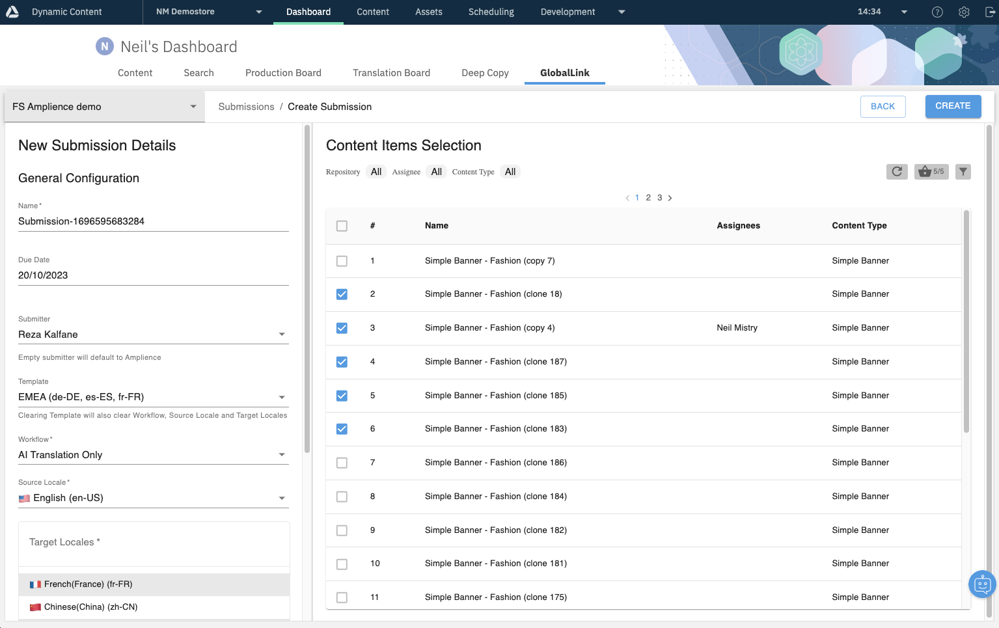
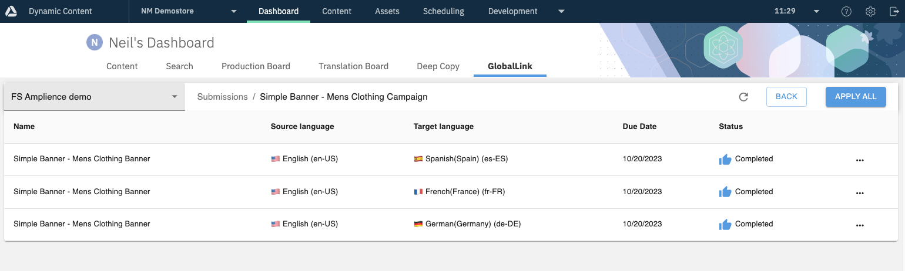
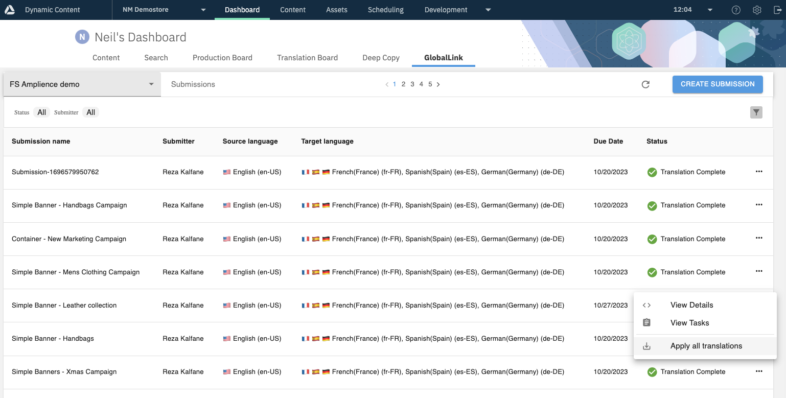

# dc-extension-globallink-dashboard

## Using the extension

This section covers how to use the GlobalLink Connect dashboard extension to translate content within Dynamic Content.

Alternatively, return to [README.md](../README.md) for more information on the extension.

<!-- MarkdownTOC autolink="true" -->

- [Useful Information](#useful-information)
  - [Configurable Values](#configurable-values)
  - [Preparing your content](#preparing-your-content)
  - [Creating a submission](#creating-a-submission)
    - [New submission details](#new-submission-details)
    - [Content item selection](#content-item-selection)
    - [In-progress translations](#in-progress-translations)
  - [Reviewing submissions](#reviewing-submissions)
    - [Filtering submissions](#filtering-submissions)
  - [Applying a translation](#applying-a-translation)
    - [Applying translation from Tasks view](#applying-translation-from-tasks-view)
    - [Applying translation from Submissions view](#applying-translation-from-submissions-view)
    - [Completed translations](#completed-translations)

<!-- /MarkdownTOC -->

## Useful Information

### Configurable Values

Some values within the GlobalLink Connect dashboard are configurable at the point of setup, meaning that the documentation may vary slightly from what you actually see within Dynamic Content. Below is a table of any configurable values you may need to be aware of.

| **Property**    | **Description**                                              |
| --------------- | ------------------------------------------------------------ |
| Extension Label | The name of the extension as it appears within the "Dashboard" tab of Dynamic Content. This documentation refers to this as "GlobalLink Connect", but as this is configurable may vary within your environment. |
| Workflow States | A mapping of Dynamic Content’s workflow states to determine which content items can be translated, and where they are in the translation process.  **ready:** The workflow state denoting that the content item is ready to translate. (Eg "Translation: Ready") **inProgress:** The workflow state denoting that the content item has an open submission. (Eg "Translation: In-Progress") **translated:** The workflow state denoting that the content item’s submission is complete, and its translations applied. (Eg "Translation: Complete") |

### Preparing your content

When you create your content, there are a couple of things you will need to do to ensure that this content is available for translation:

1. Assign the source locale to your content item.
   - For example, if you are looking to translate your content from English to German, you may want to assign en-US, or en-GB.
2. (Optionally) assign the content item to a person.
   - This is not mandatory for translation but may help with finding the content item when you create a submission, as content items can be filtered by assignee.
3. Flag your content item as ready for translation with a workflow state.
   - To ensure that content is not sent for translation prematurely, the GlobalLink dashboard uses workflow states to determine what can and cannot be sent for translation. To flag your content item for translation, set the workflow state to **[ready](#configurable-values)**

Each of these settings can either be applied via the “Save content” menu when you first save a content item, or can be applied by right-clicking your content item from the content library afterwards (“Assign Locale”, “Assign to”, and “Set status” respectively).

### Creating a submission

Once you have created one or more content items and made them ready for translation, these can now be sent for submission to GlobalLink via the dashboard extension. This can be found by navigating to the “Dashboard” tab within Dynamic Content, and selecting **[GlobalLink Connect](#configurable-values)**.

This will take you to the GlobalLink dashboard extension and will provide you with an overview of existing submissions and the ability to create new submissions, for any configured projects.

Once the extension has loaded, ensure that you have selected the appropriate GlobalLink project via the dropdown in the top-left corner, and click “Create Submission” to proceed with your new translation request.

#### New submission details

Once in the “Create Submission” screen, you can then add detail to your Submission in the left-hand pane.

| **Property**            | **Description**                                              |
| ----------------------- | ------------------------------------------------------------ |
| Name                    | The name of your submission. Auto-generated, but can be overridden. |
| Due Date                | The intended due date of the submission’s completion.        |
| Submitter               | The name of the person creating the submission. This allows you to select from a drop-down of the current active users on the account. |
| Template                | Pre-fill the submission with custom templates configured for your account. This allows selection via drop-down. |
| Workflow                | The translation workflow which GlobalLink will use to process your submission. |
| Source Locale           | The original locale of the content item(s) you wish to translate. This allows selection via drop-down of all available locales on your account. |
| Target Locales          | The intended locale(s) you wish to translate your content items into. This allows multiple selections of all available locales on your account. |
| Additional Instructions | Any additional information or instructions you may want to pass to GlobalLink along with the submission. |

#### Content item selection

As well as the submission details, this stage will allow you to select the content item(s) you wish to translate via the right-hand pane. By default, this will list all content items which meet the following criteria:

1. Locale matches your chosen source locale

2. Workflow state is set to **[ready](#configurable-values)**

3. The content type is configured to allow translation

This list of content items can be filtered further by the filter controls at the top of the content item selection pane:

| **Property**  | **Description**                                              |
| ------------- | ------------------------------------------------------------ |
| Search        | Free text entry.  Any valid content items which match your search term will be returned in the content item picker. |
| Repository    | Specifies which repository content items will be listed from.  Only one specific repository can be selected at a time, but "All" can be chosen to list content regardless of the repository it is contained in. |
| Assignees     | If selected, this will only return content items which have been assigned to the chosen assignee(s).  One or more assignees can be chosen. If none are chosen, this filter will not be applied. |
| Content Types | If selected, this will only return content items of the chosen content type(s).  One or more content types can be chosen. If none are chosen, this filter will not be applied. |

Up to **[50](#configurable-values)** content items can be selected for a single submission via a checkbox selection. Once you have filtered and selected the desired content items to send for translation, click “Create” to send this submission to GlobalLink. Alternatively click “Back” if you do not wish to proceed at this stage.

#### In-progress translations

Once a content item has been sent for translation via a submission, the GlobalLink extension will automatically tag that content item with the **[inProgress](#configurable-values)** workflow state.

This does not prevent you from making further modifications to the content item, but if you wish to submit these modifications for translation these will again need to be prepared and sent for translation, starting with the “[Preparing your content](#Preparing your content)” step.

### Reviewing submissions

With your submission created you can now review and monitor its progress, along with other submissions, in the extension’s “Submissions” view.

This will show you an overview of the all submissions on your project from their inception (Pre-process) through to their successful application to your content (Translation Complete).

The individual tasks for each submission can also be viewed, either by double-clicking the desired submission row, or selecting “View Tasks” from its context menu to the right.

This list will show individual tasks for each language direction for each submitted content item.

#### Filtering submissions

All submissions for the chosen project will be displayed by default when viewing the Submissions List. However the list can be filtered to help identify the submission(s) you are looking for by using the filter controls at the top of the submissions pane.

| **Property**    | **Description**                                              |
| --------------- | ------------------------------------------------------------ |
| Submission Name | Free text entry. Any submissions for the selected project which match your search term will be returned in the submissions list. |
| Status          | Allows you to select one or more submission statuses to filter the list by. |
| Options         | Allows you to select one or more options flags to filter the list by. |
| Submitter       | Allows you to choose a submitter from a dropdown of active users on the account, to filter the list by. |

### Applying a translation

Once a task or submission is in the “Completed” state, this means that the translation is complete, and is ready to apply to your localized content item(s). 

This can be done by selecting “Apply Translation” from an individual task’s context menu, or “Apply all translations” from the submission’s context menu (which will automatically apply translations for any child tasks in the “Completed” state).

Each translation will create a localized copy of the content item in the target language, and will then update the localized content item with the task’s translations. If a localized item already exists for the source item in the destination locale, then that item will be updated instead. 

#### Applying translation from Tasks view

#### Applying translation from Submissions view

#### Completed translations

Once a translation has been applied via a task or submission, the GlobalLink extension will automatically tag the source content item with the **[translated](#configurable-values)** workflow state.

As with in-progress translations, this does not prevent you from making further modifications to the content item, but if you wish to submit these modifications for translation these will again need to be prepared and sent for translation, starting with the “[Preparing your content](#Preparing your content)” step.

With the translation complete, you should now also be able to find localized and translated copies of your content item(s) in the appropriate repositories for each language translated.

